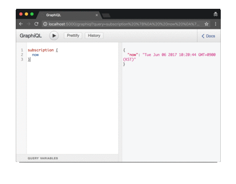

# example-graphql-subscriptions

Minimal GraphQL Subscription Example

## Schema

```graphql
type Query {
  now: String
}
type Subscription {
  now: String
}

schema {
  query: Query
  subscription: Subscription
}
```

## How to Run
```
npm install
npm start
```

